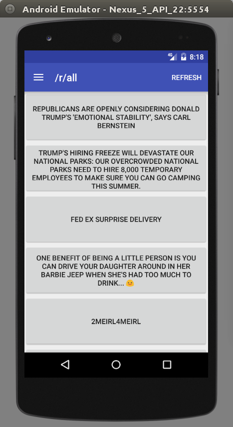
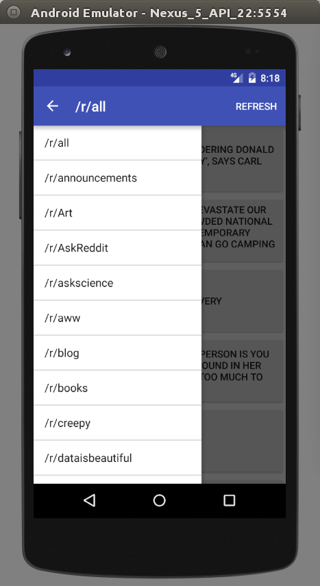
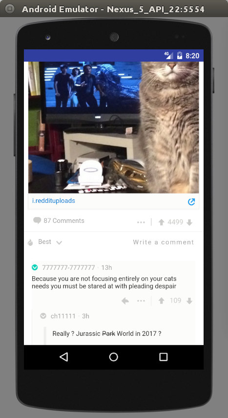

# RedditGrabber

[RedditGrabber](https://github.com/mike591/RedditGrabber) is a minimalistic Reddit application.

## Features & Implementation

### List of posts from the front page

App opens up to the home page. Here, posts from the front page are displayed as a list.

### Side Bar

Users can open up a sidebar to switch between subreddits.

### Web View

App implements webview to open up links and display the page onto the phones screen.
